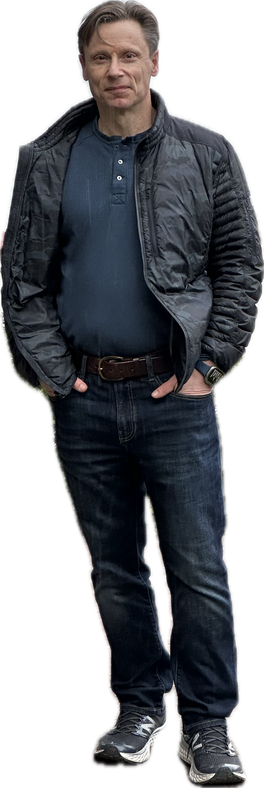

::: {.intro}

## Welcome

Hi, I’m Micah Adler. I am currently a Visting Scientist at MIT CSAIL.  Below is a summary of my work on **artificial intelligence**.

**My approach to research:** First and foremost, I love to collaborate.  If you have similar interests, are wondering about anything I've written, or are working on a problem you think I might be interested in, please reach out.  My background is in theoretical computer science, so I tend to take a "theory first" approach to research, but it is also important to follow that up with real experiments.  I'm interested in all things AI.

**Other research:** If you’re interested in my broader research outside artificial intelligence, check out the [full list of my publications](other-research.qmd).

:::

---

Click any title to view the abstract, then follow the arXiv link.

